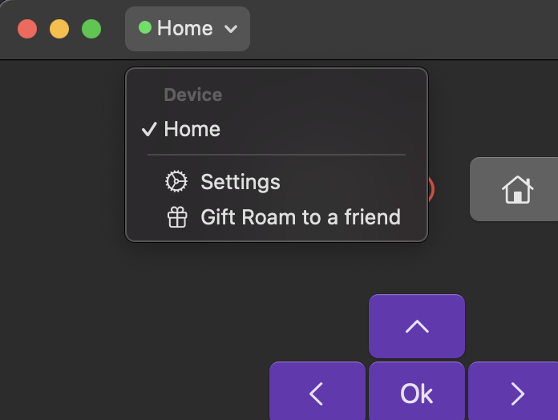

Last year I bought a simple Hisence Roku TV for my living room. The TV comes with a physical remote control and Roku distributes an iOS app that can control it over the local network. But Roku does not offer a MacOS version of this app. I often sit on my couch working on my computer and want to control the TV (for example to mute an ad break) without having to find my phone or a physical remote. I first tried installing a few 3rd party apps "Designed for iPad, not verified for macOS" on my computer, but every one I tried either lacked features or wanted me to pay an absurd $25 yearly subscription to use the remote.

Interestingly enough, Roku themselves publish a developer remote app for macOS [here](https://devtools.web.roku.com/RokuRemote/), but it's built for large-scale device testing/scripting and it doesn't even have a power-on/off button. I did use this dev tool as my go-to remote for a few months, but eventually I got fed up and decided to build the remote app I wanted to use.

I wanted to share a few things I learned about modern cross-platform apple development from building a complete app with little previous swift experience.

## Learning the Roku API

The first step I took was to find information on the Roku API. How does the iOS app actually control the TV. Thankfully, Roku publishes a guide to their ECP (External Control Protocol) API [here](https://developer.roku.com/docs/developer-program/dev-tools/external-control-api.md). This ECP API provides a set of commands to control the TV, and several queries that get information about the device's capabilities, installed applications and current state.

The parts of the API Roam uses are simple enough to be demonstrated in a few lines of curl.

```bash
# Query Device Info
curl -X GET http://$ROKU_IP:8060/query/device-info
curl -X GET http://$ROKU_IP:8060

# Query App Info
curl -X GET http://$ROKU_IP:8060/query/apps
curl -X GET http://$ROKU_IP:8060/query/icon/$APP_ID

# Press any buttons in the Remote
curl -X POST http://$ROKU_IP:8060/keypress/VolumeUp
curl -X POST http://$ROKU_IP:8060/keypress/Home

# Type Characters (keyboard entry)
curl -X POST http://$ROKU_IP:8060/keypress/Lit_r
curl -X POST http://$ROKU_IP:8060/keypress/Lit_s

# Launch Apps
curl -X POST http://$ROKU_IP:8060/launch/$APP_ID

# Power On/Off
curl -X POST http://$ROKU_IP:8060/keypress/PowerOff
curl -X POST http://$ROKU_IP:8060/keypress/PowerOn
```

### Device Discovery with SSDP

Besides direct control, Roku devices support device discovery over [Simple Service Discovery Protocol](https://en.wikipedia.org/wiki/Simple_Service_Discovery_Protocol) (SSDP). This protocol uses UDP multicast on port 1900 with a HTTP-like format to provide the IP address of the device.

Here's an example of what Roam sends to discover the device's IP address

```bash
nc -u 239.255.255.250 1900 <<EOF
M-SEARCH * HTTP/1.1
Host: 239.255.255.250:1900
Man: "ssdp:discover"
ST: roku:ecp
EOF
```

Roku TV's respond to the SSDP request with a response like this. The `Location` header contains the IP address and port of TV.

```bash
HTTP/1.1 200 OK
Cache-Control: max-age=3600
ST: roku:ecp
Location: http://$RokuIP:8060/
USN: uuid:roku:ecp:$RokuUID
```

### Power-On with Wake on LAN

After the device is powered off by the remote, or if it sits idle for long enough it will enter a state of deep sleep where it no longer responds to the ECP API. This means that the standard `/keypress/PowerOn` command will not work to wake the device up. To wake the device up from this state, Roam uses [Wake on LAN](https://en.wikipedia.org/wiki/Wake-on-LAN) (WOL). WOL is a well-standardized protocol supported by many devices that allows a device to be woken up by a magic UDP multicast packet matching the device's MAC address. Roku TV's typically support WOL on both the WiFi and Ethernet interfaces.

Here's how my code looks to send a WOL packet to the device

```swift
func getWOLPacket(macAddress: String) -> Data? {
    var packet = Data()
    // Create the header with 6 bytes of FF
    for _ in 0..<6 {
        packet.append(0xFF)
    }

    // Parse MAC address and append it 16 times to the packet
    let macBytes = macAddress.split(separator: ":").compactMap { UInt8($0, radix: 16) }
    guard macBytes.count == 6 else {
        logger.error("Invalid MAC address")
        return nil
    }

    for _ in 0..<16 {
        packet.append(contentsOf: macBytes)
    }
    return packet
}

func wakeOnLAN(macAddress: String) async {
    let host = NWEndpoint.Host("255.255.255.255")
    let port = NWEndpoint.Port(rawValue: 9)!
    let parameters = NWParameters.udp
    let connection = NWConnection(host: host, port: port, using: parameters)

    guard let packet = getWOLPacket(macAddress: macAddress) else {
        logger.error("Invalid MAC address")
        return
    }

    let timeout = DispatchTime.now() + .seconds(5) // Set a 5-second timeout for sending the WOL packet
    let statusStream = AsyncStream { continuation in
        // Start a timer to handle timeout
        DispatchQueue.global().asyncAfter(deadline: timeout) {
            continuation.yield(false)
            connection.cancel()
        }

        connection.stateUpdateHandler = { state in
            if state == .ready {
                connection.send(content: packet, completion: NWConnection.SendCompletion.contentProcessed({ error in
                    if let error = error {
                        logger.error("Error sending WOL packet for MAC \(macAddress): \(error)")
                    } else {
                        logger.info("Sent WOL packet")
                    }
                    connection.cancel()
                    continuation.yield(true)
                }))
            } else {
                switch state {
                case .failed:
                    continuation.yield(false)
                case .cancelled:
                    continuation.yield(false)
                default:
                    return
                }
            }
        }
        connection.start(queue: .global())
    }

    var iterator = statusStream.makeAsyncIterator()
    let canSendPacket = await iterator.next() ?? false

    if !canSendPacket {
        logger.error("Unable to send WOL packet within 5 sec")
    }
}
```

Even in this code you can see the tension of working with UDP in swift's async/await model. Apple currently recommends the `Network` framework for handling all low-level networking operations, but the `Network` framework is built on a callback model. So to use the `Network` framework with async/await, I typically wrapped these callbacks with an `AsyncStream` and then use the `AsyncStream` to yield the result of the operation. This setup is always super verbose, but it means I can avoid get warnings in XCode about shared mutable state.

Ideally this function could be implemented trivially with something like `NWConnection.send(content: Data) async throws -> Bool` but that's not available in the current API.

### Headphones Mode (Private listening)

Roku TV's support a headphones mode where the audio is streamed to the Roku remote application so that the user can listen to the TV audio through headphones connected to the phone. This is done using RTP (Real-time Transport Protocol) for audio streaming and RTCP for control. This protocol relies on RTP and RTCP but I will go over the details in a later section.

## Overall Architecture

I started with a blank SwiftUI app in XCode and followed the apple recommendations to get a simple version working

-   Swift Package Manager for dependencies
-   The `Network` framework for (almost) all networking
-   SwiftUI components for the UI
-   SwiftData for data storage (saved devices)
-   Async/Await wherever possible

Roam doesn't need a backend server or even much in-app data management because the TV manages it's own state, so all Roam needs to do is track a simple connection state and periodically refresh the device's list of capabilities.

Because Roam don't have very much state management, it was easiest for me to do everything from with SwiftUI views. I used SwiftData to track stored state, but I was able to avoid any kind of view-model or controller layers. The View components themselves are responsible for querying the data model and updating the data model when things change. For example here's my view that shows the app list for a device

```swift
struct AppLinksView: View {
    @Query private var appLinks: [AppLink]

    var handleOpenApp: (AppLinkAppEntity) -> Void
    let rows: Int

    init(deviceId: String?, rows: Int, handleOpenApp: @escaping (AppLinkAppEntity) -> Void) {
        self.handleOpenApp = handleOpenApp
        self.rows = rows

        _appLinks = Query(
            filter: #Predicate {
                $0.deviceUid == deviceId
            },
            sort: \.lastSelected,
            order: .reverse
        )
    }

    var body: some View {
            ScrollView(.horizontal, showsIndicators: false) {
                Spacer()
                LazyHGrid(rows: Array(repeating: GridItem(.fixed(60)), count: rows), spacing: 10) {
                    ForEach(Array(appLinks.enumerated()), id: \.element.id) { index, app in
                        AppLinkButton(app: app, action: handleOpenApp)
                    }
                }
                    .scrollTargetLayout()
                Spacer()
            }
            .scrollTargetBehavior(.viewAligned)
            .safeAreaPadding(.horizontal, 4)
            .frame(height: 80 * CGFloat(rows))
    }
}
```

There are a couple of instructive details in this example.

First of all we can see at the top of the view that there is an `@Query var appLinks`. This is a SwiftData native property wrapper to automatically query a list of objects from the stored data model and refresh the view when the stored data changes.

Unfortunately `AppLinks` needs to filter these icons based off the selected device ID, so I need to supply a runtime-dynamic `#Predicate` to the query. This can't be done using the `@Query` itself because property wrappers can't take runtime arguments, so I need to use the underscored `_appLinks` property to modify the query with the dynamic predicate.

This behavior isn't featured very prominently, but it is documented in the [Query guides](https://developer.apple.com/documentation/swiftdata/filtering-and-sorting-persistent-data#Update-a-query-dynamically).

Foot-guns like this are still relatively common with SwiftData, but Roam doesn't have a complex-enough data model to justify dropping down to CoreData or something home-grown.

### Data Modeling (Swift Data)

So I stored two different types of objects in the data model: `Device` and `AppLink`. Each device tracks a Roku TV's capabilities, state and connection information. Each `AppLink` tracks an installed application on the Roku TV and the last time it was selected.

```swift
@Model
public final class Device {
    @Attribute(.unique) public var udn: String

    // User-configurable parameters
    public var name: String
    public var location: String

    // Various status information
    public var lastSelectedAt: Date?
    public var lastOnlineAt: Date?
    public var lastScannedAt: Date?
    public var lastSentToWatch: Date?
    public var deletedAt: Date?
    public var powerMode: String?
    public var networkType: String?

    // Device networking information (queried from the device)
    // Roam needs ethernet MAC AND WiFi MAC because the
    // WOL packets depend on the MAC addressed used by the device
    public var wifiMAC: String?
    public var ethernetMAC: String?

    public var rtcpPort: UInt16?
    public var supportsDatagram: Bool?
}
```

```swift
@Model
public final class AppLink {
    public let id: String
    // Either `channel` or `app`
    public let type: String
    public let name: String
    public var lastSelected: Date? = nil

    // Reference to the device so only device-apps get queried from disk
    public var deviceUid: String? = nil

    // Store icon as raw data outside of the model (for performance)
    @Attribute(.externalStorage) public var icon: Data?
}
```

Each TV and App also has an associated icon which means that querying devices with a lot of apps comes with a tangible performance drop. To handle this in practice, I store the `AppLink`'s in a separate table that isn't queried unless the app is explicitly displayed as a button on the screen.

Depending on the app, Roku can use either png or webp images for app icons, and provides the mime type in the response headers. Roam don't actually save these mime types because the native `Image` components in SwiftUI handles decoding from each format transparently.

You may also note here that the model stores both the ethernet and WiFi MAC addresses. Roam keeps both because when it needs to wake the device with WOL, it attempts WOL with both WiFi and ethernet interfaces.

There were also a few gotchas with `SwiftData` that needed to be worked around

-   I had to mark devices as `isDeleted` instead of directly deleting the devices because my `@Query` properties caused crashes after deleting models. I tried several methods to avoid this crash but soft deletes were the only reliable fix
-   SwiftData models really need to be stored in [VersionedSchema](https://developer.apple.com/documentation/swiftdata/versionedschema) because if the model changes in a backwards-incompatible way, the pre-migration schema must be a `VersionedSchema` or the data will fail to load. I learned this the hard way and had wipe all users' existing data when I made my first data migration.
-   SwiftData supports storing `AppLink`'s as a sub-model of `Device`, but I chose to store them separately when I tried storing them as a sub-model, the performance was very choppy when a large number of `AppLink`'s needed to be loaded to query a list of available devices.
-   Roam offers widgets and shortcuts that need to use the same data as the main app, so I needed to setup my data within an [app group](https://developer.apple.com/documentation/xcode/configuring-app-groups) so all components could share.

## ECP API

So I kind of lied earlier when I said that the protocol was as simple as using curl. The curl commands work, but there is one pretty frustrating inherent limitation to sending a http request per command. Each request can fail or succeed independent of any other request, so if you try to type out "Harry Potter" on your keyboard, some of the letters could get dropped or sent out of order.

This is a pretty frustrating problem that doesn't have a good solution, but thankfully Roku provides a solution in the form of the ECP API over Websockets.

This Websockets API is a direct translation of the ECP API over HTTP. The websocket connection accepts JSON encoded ECP commands and responds with a success or failure response just like the HTTP API does.

What makes the Websockets formulation better is that it's reliable and ordered. If the `a` in "Harry Potter" fails, it will get retried again before the `r` is sent. This is a pretty nice guaranty, so I implemented the Websockets API for all commands that affect the device state. I continue to use the HTTP API for any query requests because these don't have the same reliability or ordering requirements.

The websocket connection can also be used like a pub-sub system to get updates on the device's state, but I don't have a good use for this feature at this time.

### Getting Connected

The websocket connection is an authenticated websocket connection, so Roam needs to respond to an auth challenge after connecting before the device will accept any commands. Here's how I setup the connection

1. Connect to the websocket endpoint with the `ecp-2` protocol specifier
2. Wait for the first message from the device which will be the auth challenge.
3. Encode the auth response using the secret key `95E610D0-7C29-44EF-FB0F-97F1FCE4C297`.

    The process for encoding the auth response can be seen [here](https://github.com/msdrigg/Roam/blob/80303d2e10eff70a83ea560de8ccf313e29c8ce7/Shared/Backend/ECPSession.swift#L346)

    I wouldn't have been able to do this without referencing the [RPListening](https://github.com/runz0rd/RPListening) or the [roku-audio-receiver](https://github.com/alin23/roku-audio-receiver) projects. These projects include implementations of the ECP Auth API in Python and Java. I used these implementations to understand how the auth challenge works and how to respond to it.

4. Send any future commands over the websocket connection. These commands are sent as JSON encoding of the ECP command including URL, body and any headers. It's honestly pretty messy, but Roam don't have to worry about it because all our ECP commands only include the method and the PATH with no body.

## Navigating the Local Network

So before Roam can connect to the devices, it has to discover them. To find devices, Roam uses a combination of SSDP and local network scanning.

SSDP works most of the time, but it can fail (it's a UDP multicast protocol after all). Roam uses a full network scan to ensure quicker device discovery when the user requests a device refresh or when the app is first opened.

To scan the full local network, Roam needs to make a guess at the local network's DHCP range. Roam does this by getting the device's local IP address and netmask and then estimating the DHCP range from that information. The `Network` framework doesn't provide a way to get detailed device information, so I needed to use the `getifaddrs` function from the BSD sockets API to achieve this. Thankfully, BSD sockets are supported on all apple platforms.

Once it has this device information, Roam then tries to open a TCP connection to each IP address in the DHCP range on port 8060 (the ECP port). If the connection is successful, Roam tries to queries for the device's information using `/query/device-info` and accepts the device if this query succeeds.

This scan is quite slow and expensive but I limit it to only run very infrequently or when the user explicitly requests a device refresh scan. Additionally, I limit the number of scanned IP's to 1024 total and 37 concurrently to prevent the scan from overwhelming the network or taking a huge amount of time. For a typical network (200 or so IP's), these scans usually finish pretty quickly because the TCP connections are set to time out after 1.2 seconds.

When I first added support for SSDP and WOL, these features worked correctly on macOS and even in the iOS simulator, but failed to work on real iOS devices. After some digging, I found that sending multicast packets requires a [specific capability](https://forums.developer.apple.com/forums/thread/663271), and I would need to request this capability from Apple support to get it enabled for my account. The macOS networking stack doesn't have the same restrictions, so it worked fine there even without the capability.

Additionally, on WatchOS complex networking isn't supported at all. This means that only basic HTTP requests are allowed at all outside of certain restrictive contexts. This means that I can't use the ECP API over Websockets on WatchOS and need to fall back to the plain HTTP API. It also means I can't support WOL or SSDP on WatchOS.

## Private Listening

So the last feature of Roam I haven't discussed much is Headphones mode. As I mentioned previously, Roku TV's supports a headphones mode to stream audio from the TV to the remote application. The official Roku app supports this functionality, but I haven't seen another 3rd party app that supports it. I wanted to support this feature because it's a feature I use a lot and I knew it would set my app apart.

My first step was to setup `tcpdump` on my home router to capture traffic between my phone and the Roku TV. I was able to see some RTCP traffic on port 6970 and RTP traffic on port 5150 using packet type 97. There were also some commands sent over ECP that seemed like RTP initiation.

From here I did some googling and found two projects that had implemented the audio streaming protocol for Roku TV's.

-   [RPListening](https://github.com/alin23/roku-audio-receiver) (Java + FFPlay for audio playback)
-   [roku-audio-receiver](https://github.com/runz0rd/RPListening) (Python + GStreamer for audio playback)

I got the Java project to build and run on my computer, and the audio actually played, but I was never able to get the `roku-audio-receiver` to work because python dependencies suck. From looking these projects, I could tell that the protocol sent some stream initiation packets over RTCP (`NCLI` and `VDLY`) and waited for responses. After this handshake, these programs decoded the packets with the `opus` codec and sent them to the audio output. Additionally, these apps periodically send a RTCP recipient report to the TV to keep the stream alive.

Looking at the naming for the `NCLI` and `VDLY` packets, it was pretty clear that the `NCLI` packet initiated a new stream client and the `VDLY` packet set the audio delay.

Taking this information into my application, I pulled in dependencies for the `opus` codec (SwiftOpus) and RTP decoding (SwiftRTP). I went back-and-forth with the TV trying to get the connection to setup and stay alive. At first there was no connection or sound, then I would get static, then a short-lived connection and finally I got the audio to stream reliably. At the end of the day I tried to keep everything as simple as possible with the following setup.

1.  Create an audio engine an input node
    -   Ensure the input node matches the opus clock speed and has 2 channels
    -   The engine has a builtin output node for playback
1.  Send a `NCLI` packet to the TV to initiate the stream
1.  Send a `VDLY` packet to the TV to set the audio delay.
    -   I set the audio delay really high to 1200ms. Roam doesn't need to care much about latency that much because the TV will be playing the audio in sync with the video after factoring in the delay. This long delay helps handle the output latency change when users put in or remove headphones without refreshing the TV's VDLY.
    -   This delay also gives us a large jitter buffer to handle network latency.
1.  Wait for the TV to send a `NCLI` and `VDLY` response
1.  Send a RTCP recipient report every 5 seconds to keep the stream alive
1.  Decode the RTP packets with the opus codec using the float32 format with 2 channels and a clock rate of 48000.
1.  Convert the audio packets to match the output's audio format with an `AudioConvertor` and schedule the packet on the input node
    -   The correct output audio parameters can be gotten from the `engine.mainMixerNode.outputFormat(forBus: 0)`
    -   Output packets are sent at regular 10ms intervals, so the correct time to schedule a packet can be determined directly from the start time, the sample rate, and the packet number

This final setup honestly seems quite simple after typing it out here but it took a lot of trial and error to get everything working. On top of this there was a good bit of research on the best way to handle streamed audio. Honestly even with this setup including a jitter buffer and a large audio delay, I also am getting the benefit of the fact that all the audio is being streamed over the local network with minimal packet loss. I can't imagine what trouble people running WebRTC stacks must be facing to get reliable, low-latency and cross-internet audio streaming.

I have gotten some user reports that Headphones Mode doesn't work with their TV. I have tried debugging what's going on but I can't replicate well enough to fix it. Every time I'm in a house with a new Roku TV I test it to see if it works, and I haven't found any issues yet.

## Debugging

After all the work on private listening, I am seeing highly reliable streaming on all the devices I have tested, but I have still received some user reports saying that the feature doesn't work on their TV. It's possible that this is the fault of the TV, but I still wanted to setup a way to collect remote debug logs from the user's device to help diagnose the issue.

With my first couple user bug reports, I walked them through how to open the MacOS Console app and send me the logs. This was a pretty painful process for both me and the user, so I wanted to setup a way to collect logs from the app itself. I was already using the builtin `OSLog` framework to log messages, and I found that apple provides a `OSLogEntry` object that can be used to collect these logs. Once they are collected, I send them to a publicly-writable S3 bucket along with some metadata about the users device, TV and app state.

Then I provide the user with the unique ID of their debug log upload so they can include it in their bug report to me.

Funnily enough, I haven't gotten any bug reports since I implemented this feature, but I'm sure the time will come.

## Cross Platform Support

After getting the macOS app working, I expanded the app to support iOS, WatchOS, TVOS and VisionOS. Funnily enough, all of these apps except WatchOS could be supported from within one XCode "Target".

SwiftUI makes cross-platform apps work pretty smoothly. All of the core components are supported across all platforms, but there are a few styles that only have partial platform support. For these API's, I use conditional compilation with `#if/#else` to support the different styles on different platforms.

Here are a few challenges I faced when adding support for each platform

-   VisionOS didn't support restricting the minimum size of the window to match the content size, so I had to add an explicit minimum window size on this platform.
-   The keyboard entry for VisionOS and TVOS is different from iOS. Instead of extending into the window, it replaces the entire window the a keyboard entry view. This required special handling to avoid dismissing the keyboard before the user was done typing.
-   WatchOS and TVOS don't support webp images, so I had to transcode the webp images into png before storing them in the model on these devices. I used `libwebp` via [libwebp-Xcode](https://github.com/SDWebImage/libwebp-Xcode) to accomplish this.
-   The simulator for iOS doesn't support binding to a local network port for UDP operations, so private listening fails in the simulator. This is a bug and I'm tracking it [here](https://openradar.appspot.com/radar?id=5580336264118272)
-   MacOS doesn't really put any restrictions to applications using the network. iOS and WatchOS require users to grant permissions to connect to devices on the local network, and require an additional capability to send multicast packets. This doesn't mean any additional code for these platforms but it does mean that there are additional steps to get the app approved for the app store.
-   The WatchOS app doesn't support [low level networking](https://developer.apple.com/documentation/technotes/tn3135-low-level-networking-on-watchos), so I can't support WOL or SSDP on WatchOS. In theory I could still support headphones mode, but I haven't implemented this capability because the AudioSession API on WatchOS has different requirements.
-   My application was built for MacOS to support scale well with changing screen sizes, so adding support for portrait/landscape orientations came for free.
-   There were a lot of challenges getting keyboard support working on iOS and macOS. Both of these ecosystems have slightly different UI API's (AppKit and UIKit), and they require that the component handling keyboard input be the first responder. This is particularly painful on macOS because the first responder status can be changed when the window loses and regains focus.
-   The iOS -> watchOS data transfer mechanism (to send device metadata) is unreliable by design and it's pretty annoying when the user is waiting on the transfer to occur so they can control their device.
-   The TVOS screen interaction requires requires moving the focus from button to button with the remote. Our application isn't laid out into nice rows or columns, so I need to use [focusSection](<https://developer.apple.com/documentation/musickit/artworkimage/focussection()>) in the SwiftUI layout to ensure that the focus moves as expected.

## Hooking into the Apple Ecosystem

After getting the basic device functionality working, I looked into adding some more advanced features that would be useful for users. Initially, I just wanted to add support for a remote widget so the user could play/pause or mute/unmute their TV without opening Roam. But as I looked into how to support widgets, I found out that the same core functionality (app intents) could be used to support iOS spotlight, Shortcuts and Siri integration!

Intents are basically functions that the apple OS can call when the user requests the action get performed. This request can come from a Siri request, a shortcut invocation or a widget button tap. Apple can also choose to highlight these intents in the spotlight search results on iOS.

I made intents for each button press, as well as an intent to launch an app given an app selection.

While shortcuts don't sound like they are a useful feature for my app, they are actually the easiest way to support a global keyboard shortcut. I added a shortcut for `Cmd+f10` to mute/unmute the TV and another for `Cmd+fn+space` to play/pause. This is great for when a commercial comes on and I want to mute the TV without opening the remote.

Lastly, I integrated the [RequestReviewAction](https://developer.apple.com/documentation/storekit/requestreviewaction) from the StoreKit framework to prompt the user to rate the app on the app store. I avoid prompting the user unless they have been using the app for a good bit and have used the core features a few times. I attribute my nearly 150 ratings to this feature.

## Device Publishing

I've read a lot of stories about the kafkaesque process of publishing an app on the App Store, so I was prepared for problems, and apple did not disappoint. First of all I wanted to name my app "Roam: A better Roku remote", but it got rejected in app review due to it violating the Roku trademark. I tried to point out that there are 20 apps on the iOS app store with very similar names (for example "RoByte: Roku Remote TV App"), but received several rejections. Finally a app reviewer suggested I use "For Roku" in the name to make it clear that it's a 3rd party application and the app was approved.

Since the initial publish, updates have been smooth. The reviewer even accepted my VisionOS application with only a screen recording demonstrating that the app worked on the simulator (I don't have $3500 to spend real hardware). My 15 VisionOS users thank you.

## Gimmicks

I got the idea for this section from the excellent article by [Mihhail Lapushkin](https://papereditor.app/dev#Gimmicks) on his work building the Paper Editor. I'll share some of the things I've added to Roam that are more gimmicky

So pretty early on in my development I received my first support email from a user who was having trouble scrolling through the list of their apps when using a bluetooth mouse. I was able to help them by suggesting they use shift + scroll to scroll horizontally, but really this should be supported with standard scroll because there is no vertical scroll to conflict with.

This was surprisingly difficult to implement because it wasn't just a view modifier. I had to re-implement a lot of the `ScrollView`'s niceties like inertia scrolling. Here's what it looked like in the end

```swift
import SwiftUI
import AppKit

struct CaptureVerticalScrollWheelModifier: ViewModifier {
    func body(content: Content) -> some View {
        content
            .background(ScrollWheelHandlerView())
    }

    struct ScrollWheelHandlerView: NSViewRepresentable {
        func makeNSView(context: Context) -> NSView {
            let view = ScrollWheelReceivingView()
            return view
        }

        func updateNSView(_ nsView: NSView, context: Context) {}
    }

    class ScrollWheelReceivingView: NSView {
        private var scrollVelocity: CGFloat = 0
        private var decelerationTimer: Timer?

        override var acceptsFirstResponder: Bool { true }

        override func viewDidMoveToWindow() {
            super.viewDidMoveToWindow()
            window?.makeFirstResponder(self)
        }

        override func scrollWheel(with event: NSEvent) {
            var scrollDist = event.scrollingDeltaX
            if abs(scrollDist) < 0.000001 {
                scrollDist = event.scrollingDeltaY
            }
            if !event.hasPreciseScrollingDeltas {
                scrollDist *= 4
            }

            // Handle legacy mice as event.phase == .none && event.momentumPhase == .none
            if event.phase == .began || event.phase == .changed || (event.phase.rawValue == 0 && event.momentumPhase.rawValue == 0)  {
                handleScroll(with: scrollDist)
                scrollVelocity = scrollDist * 1.4
            } else if event.phase == .ended {
                decelerationTimer = Timer.scheduledTimer(withTimeInterval: 0.009, repeats: true) { [weak self] timer in
                    guard let self = self else { timer.invalidate(); return }
                    self.decelerateScroll()
                }
            } else if event.momentumPhase == .ended {
                decelerationTimer?.invalidate()
                decelerationTimer = nil
            }
        }

        private func handleScroll(with delta: CGFloat) {
            let scrollDist = delta

            guard let scrollView = self.enclosingScrollView else { return }
            let contentView = scrollView.contentView
            let contentSize = contentView.documentRect.size
            let scrollViewSize = scrollView.bounds.size

            let currentPoint = contentView.bounds.origin
            var newX = currentPoint.x - scrollDist

            // Clamp to viewable region
            let maxX = contentSize.width - scrollViewSize.width
            newX = max(newX, 0)
            newX = min(newX, maxX)

            scrollView.contentView.scroll(to: NSPoint(x: newX, y: currentPoint.y))
            scrollView.reflectScrolledClipView(scrollView.contentView)
        }

        private func decelerateScroll() {
            if abs(scrollVelocity) < 0.1 {
                decelerationTimer?.invalidate()
                decelerationTimer = nil
                return
            }

            handleScroll(with: scrollVelocity)
            scrollVelocity *= 0.9
        }
    }
}

extension View {
    func captureVerticalScrollWheel() -> some View {
        self.modifier(CaptureVerticalScrollWheelModifier())
    }
}
```

There's a lot of code here to handle edge cases when the user tries to force horizontal scrolling or if they are using a trackpad.

This was a lot of extra code non-essential feature, but I got an explicit request from a loyal user so I couldn't say no.

I also added a feature to "gift" the Roam app to a friend. This feature shares a link to the app store listing for Roam.



Credit where credit is due: I also copied this feature from the Paper Editor.

## Ongoing work

So at this point I feel really good about where the app is and I think it's going to be pretty stable from here on out.

I'm going to keep working sporadically on the Headphones mode support - testing streaming on more TV's, trying to reverse engineer the mobile-sas audio streaming protocol.

I'm a bit worried that Roku will close the ECP API or make it inoperable for 3rd party developers. Even today the ECP documentation says

> In addition, ECP commands may not be sent from 3rd-party platforms (for example, mobile applications).

Well that sounds a lot like my app, but I'm going to keep supporting my application as long as I can. Even if that means capturing the ECP traffic from the official Roku app and reverse engineering it to keep Roam working.

Even if they don't shut down the whole ECP API they could shut down the RTP/RTCP audio streaming support, and I haven't been able to reverse engineer the mobile-sas audio streaming protocol yet so I'll keep working on that as well.

Besides this stability work, I'm done as far as I know. I don't have any features that I want to add and I don't have any known reproducible bugs. I'm pretty happy with that. One fun little feature I kind of want to work on is to add a user support chat to the app. I think I can get this to work with `App -> Cloudflare API -> Discord`, but I haven't looked too much into it yet.

Anyway, if this app sounds interesting, please check it out on [github](https://github.com/msdrigg/roam). The code is open source, and I'm always happy to accept big fixes or feature requests or just chat about the app.
