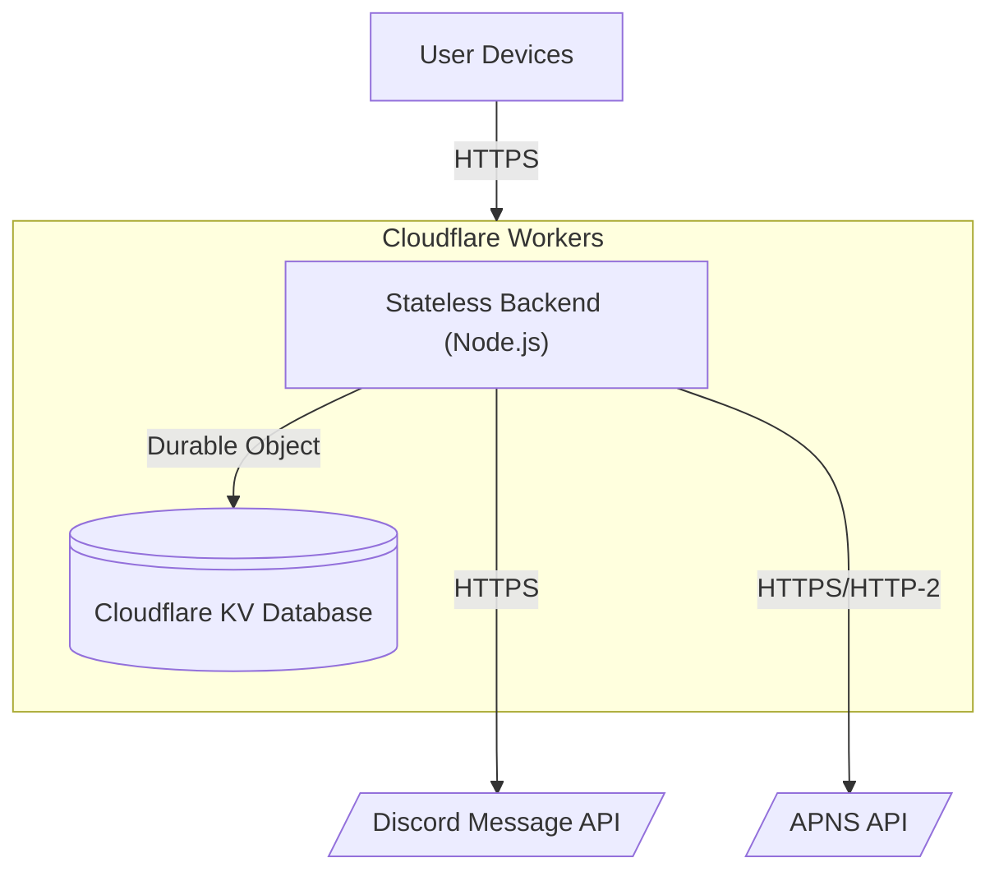
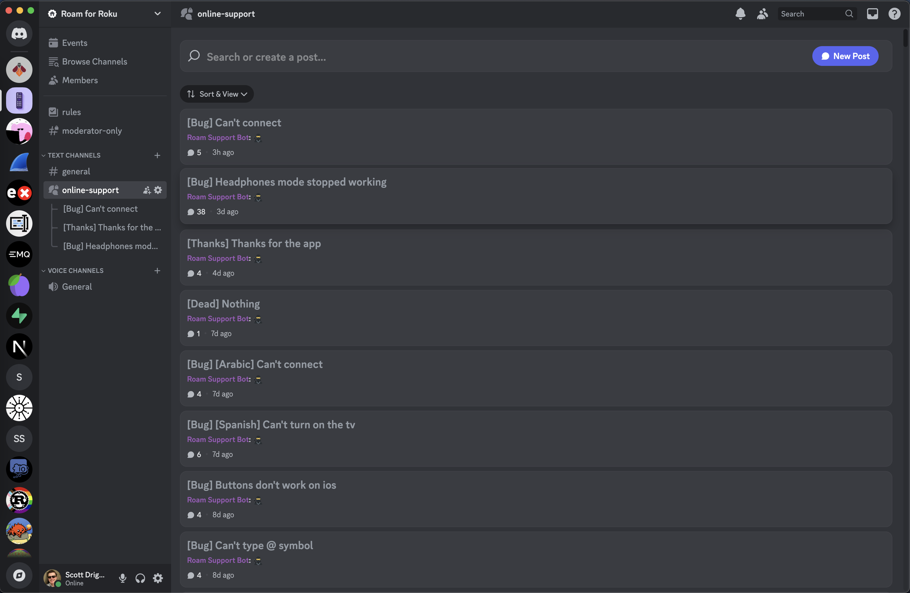
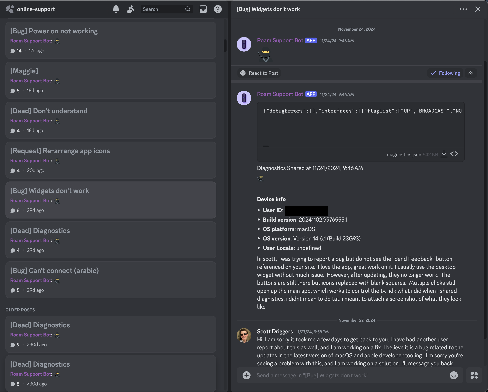
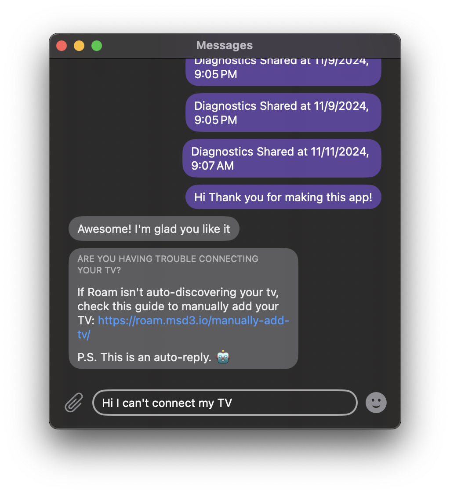

### Motivation and Inspiration

Today I'm writing about how I implemented a Discord-based in-app embedded messaging system to allow feedback and answer questions from users. I got the idea from a wonderful blog post ([https://papereditor.app/dev](https://papereditor.app/dev#feedback)) from the developer of the Paper application. In that post he talked about how he could answer user questions and get ideas for new features quickly. This functionality enticed me, and this post details how I went about developing a better-version of this same functionality.

<!-- truncate -->

Once I decided to build this, I put together a list of goals for the feature. First of all I want it to be very smooth and have the feel of the native iMessage that all of my iOS/macOS users would be familiar with -- real-time messages and notifications. Second of all I wanted the ability to quickly collect diagnostics from the app from anyone who was troubleshooting an issue. I also wanted to run this cheaply (I don't make any money off the app after all) and with minimal infrastructure maintenance and setup.

Paper's approach was to use dropbox to store json files that get synced to the developers computer and to the users' devices that contain their conversation history. The developer can edit them (maybe with some home-grown GUI) and then they get synced to the users's device and show up as a response. This has the benefit of being totally free but it doesn't provide a real-time experience and notifications would be hard to bold onto it.

### Backend

My plan was to improve this by using a discord server and a custom backend to achieve all my goals with minimal cost. Here is the architecture I came up with

The main benefit of this backend is that my code is all stateless and gets deployed however cloudflare sees fit to handle traffic in 0-N nodes wherever in the world. Then the backend connects to Discord's API and returns messages for that user, and the backend can store any user metadata (APNS token, Discord Thread ID, last received message id, etc.) in cloudflare KV on a per-user basis. All metadata is small and single value per user so there is no need for any kind of relational database or object storage. The only tricky piece of this system is that all requests to the KV storage need to be serialized because otherwise, you could have a read-after-write concurrency error between multiple backends handling two requests for the same user. I solve this by routing all relevant KV writes and reads through a Cloudflare durable object. Durable Objects (DO's) are a flexible concurrency tool but for my use case all I care about them is that they ensure requests are handled one at a time in a FIFO queue.

On the Discord side, I considered several methods for how to structure individual user messages. Ideally each user's messages would be handled independently, and I would also be able to query ALL recent messages for ANY users for the purpose of sending push notifications. This limitation pushed me away from using a channel-per-user because there isn't an API to request all messages across any channel in a server. Instead I ended up using Discord's [Forum Channels](https://support.discord.com/hc/en-us/articles/6208479917079-Forum-Channels-FAQ). One of these channels contains individual sub-threads that are meant to be used as individual Q&A from within a single larger channel. This works perfect for my use case because I can create one thread per user and then route all the users messages to their own self-contained thread while at the same time querying for the most recent messages in that channel and receive all the messages for any user.

You can find the code for my whole backend at this link [https://github.com/msdrigg/Roam/tree/main/backend](https://github.com/msdrigg/Roam/tree/main/backend)

### Push Notifications

Now that I had the stateless HTTP architecture setup, I needed to find a way to setup real-time push notifications for my app. Discord has a [gateway API](https://discord.com/developers/docs/events/gateway) that is meant for the real-time use case. This API is built around establishing and maintaining a long-term websocket connection with their servers, which does not work well with the Cloudflare Workers architecture. Even though workers do have some background-job capabilities, they are meant for short tasks and will start to become expensive or unstable if they are forced to maintain a quiet websocket connection indefinitely.

What is great for this however is [fly.io apps](https://fly.io/docs/apps/overview/). These apps behave like simple EC2 machines that run at very low cost and can stay alive indefinitely. They can be deployed trivially and I have a grandfathered-in hobby plan that allows me a couple of micro-vm's for free.

I am most familiar with rust in the backend and I wanted to keep this backend very lean to stay within fly's legacy free tier so I built the backend using a very simple rust server and the `serenity` discord api crate. In total the full code to handle push notifications is about 90 lines and is very lean. It doesn't even send push notifications itself--it makes requests to the cloudflare workers server which handles communication with APNS itself.

One final thing to note is that all communication with Apple must be over HTTP-2 because Apple doesn't want every user to establish a new connection-per-request for every push notification that gets sent, and HTTP-2 re-uses connections. I found it convenient that cloudflare workers automatically uses HTTP-2 in it's outgoing requests if the requested-server supports it!

On the whole, the whole backend is done with 0 node-js dependencies and only 4 direct rust dependencies, so I have very little code that I am relying on to make everything work.

You can find the whole code for the gateway engine here [https://github.com/msdrigg/Roam/tree/main/gateway-backend](https://github.com/msdrigg/Roam/tree/main/gateway-backend), and my code for sending APNS requests here [https://github.com/msdrigg/Roam/blob/a46652598584b39e4069afc820d6d2a8f97faef2/backend/src/apns.ts](https://github.com/msdrigg/Roam/blob/a46652598584b39e4069afc820d6d2a8f97faef2/backend/src/apns.ts)

### Discord Setup and Support-Specific Features

Overall, the whole setup looks like a discord server with a single "Roam Support" Forum channel and then individual messages within that channel contain individual conversations with each user. Here's what it looks like for me currently.

Taking a look at the whole picture, you see that I categorize each request as either `[Bug]`, `[Dead]` `[Request]` or `[Thanks]` and give it a title based off what the conversation is about. You can also see that I have a `#general` channel and that this Discord server is open to the public. Anyone can join (see the link at the bottom of this post), but you won't be able to see my `#online-support` channel because it is restricted to only me and my support bot.

For a few more support-specific features let's take a look at an individual chat with a user I had recently

Notice here that I am speaking with a `Roam Support Bot`. This is a bot that I setup to actually create the messages in discord that the users send to my API. I have to configure it like this because all API-interactions with Discord need to go through one of their Bots.

Also notice that there are a lot of messages that start with `:ninja:`. This is a secret prefix that I use to send non-user messages in the channel. You see some device metadata and the thread creation message itself. These `:ninja:` messages get filtered out by my backend so the end user never sees them. This lets me add notes to a thread directly, or for the app to send user metadata without clogging up the thread window. Also note that the diagnostics message doesn't have a `:ninja:` flag.

Lastly, note the diagnostics upload. This file upload support is available directly within discord so it makes it very easy for me to troubleshoot user issues without going outside of my main support UX.

### Frontend

Now that you have seen how the backend works, the frontend will seem much less complicated. First of all it is a simple `SwiftUI` interface that displays a list of `Message` models and loads them from local storage via a `SwiftData` binding. The only interaction with the backend is to refresh messages periodically and whenever it receives a push notification for a new message.

There are a few fun features though. One feature I stole from the original Paper blog post is to have auto-responses for common request. One such request is that users can't connect their device, so if a user starts to type out "I can't connect my TV", a curated response is returned with a way to manually add their TV.

Additionally you will notice in this message that there is a clickable link. Getting clickable links working in my messaging views weren't trivial. This is because the default `Text` view for `SwiftUI` doesn't make links clickable. My first thought was to parse the whole message searching for links and then split them into separate inline views before rendering for each message, but I found a little-documented feature of the `SwiftUI` `Text` view: It automatically makes markdown-annotated links (e.g. `[link preview](https://link.example.com)`) clickable. So now job was narrowed down to a much simpler task of replacing all naive links with markdown previews, which is a much simpler regex replacement task.

Finally, the frontend users `SwiftData` for storage, `SwiftUI` for rendering, and the `URLSession` framework for https requests. All of these frameworks are 100% crossplatform, so this UI works equally well on macOS, iOS, watchOS, visionOS or even tvOS. In practice though, I only have it available on the iOS, visionOS and macOS versions of my App due to challenges with sending text communication on tvOS or watchOS.

My code for the frontend can be found [here](https://github.com/msdrigg/Roam/blob/a46652598584b39e4069afc820d6d2a8f97faef2/Roam/Views/MessagingView.swift) and [here](https://github.com/msdrigg/Roam/blob/a46652598584b39e4069afc820d6d2a8f97faef2/Shared/Backend/WorkersBackend.swift) and [here](https://github.com/msdrigg/Roam/blob/a46652598584b39e4069afc820d6d2a8f97faef2/Shared/Models/SchemaFile.swift#L161) and [here](https://github.com/msdrigg/Roam/blob/a46652598584b39e4069afc820d6d2a8f97faef2/Shared/Models/DataActor.swift#L630)

I have considered breaking this out into a separate swift package, but I think my personal assumptions are a bit too baked-in and I would rather others to simply copy my code into their own projects if they want to replicate this feature.

### Security and other considerations

So as with any mobile-app backend, there were a lot of foot-guns along the way to building this backend. First of all, how can I authenticate users when my app is open source and I don't have any user passwords. Well I do this by auto-generating a 9-character user ID for each device that has enough entropy to be unguessable and then each request to the backend must contain the device ID to authenticate it.

Each request also contains a API Key and the backend url isn't published directly on the github (it is added alter in a config file via env variables), so I have a little bit of security-through-obscurity as well. But I am aware that these roadblocks would not stop a dedicated attacker.

Finally, I will say that my security could be significantly better. First of all, I am susceptible to DOS attacks. If an attacker was to send thousands of requests to my backend, there would be nothing to stop them and they would get my discord bot rate limited and possibly banned, they would also be able to swamp my discord channels making them unusable, but they would not be able to read any other user's messages or rack up any fees on my end because cloudflare workers are capped under the free tier.

I will say that if I needed to worry about rate-limits and DOS attacks I would start by requiring all requests to contain a unique and valid APNS token, and then rate limiting individual users. This way I could slow down bad-acting individual users and then ban them while preventing them from creating new users because they wouldn't have a new valid APNS token. In this way, Apple would basically be my user-verification service to ensure that all my users are real people and not bots.

### Conclusion

So at the beginning of this story I outlined my goals as

-   Simple messaging interface for users to contact me in-app
-   Push notifications and real-time communication
-   Easy infrastructure
-   Minimal expenses

I can say that all my deployment is done in less than 800 lines of code across both backends, and it gets updated every push to CI. This all happens for $0 a month because I am under the cloudflare, fly.io, and github actions free tiers.

Overall this work has yielded some very rewarding interactions with people. Many people have messaged me just to say "Thanks" for the free app, and many more have thanked me for my quick response to the questions or expressed surprise at the existence of a live chat window in their remote app.

I have also had several developer reach out to say that they thought the app was really impressive and they appreciated it. One of them was a developer at Warner-Brothers/Max and said he had recommended it to his whole team there.

I think it is probably a bit overkill for an app as simple as Roam, but it has let me connect with my users in a way that would not have been possible without it.
