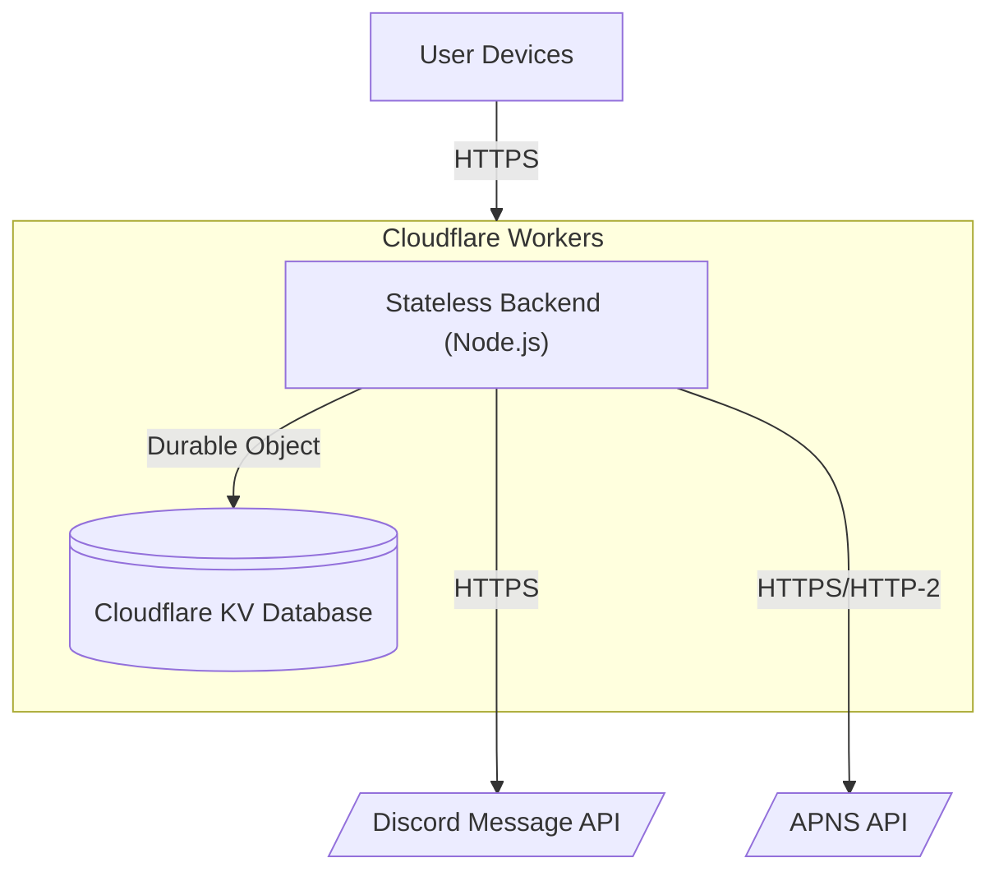
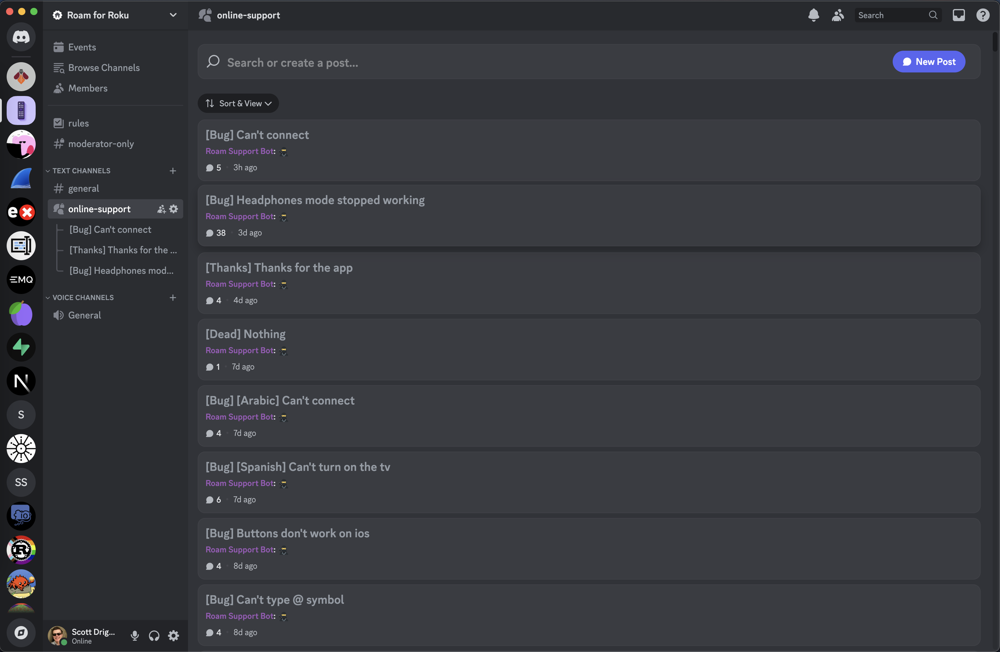
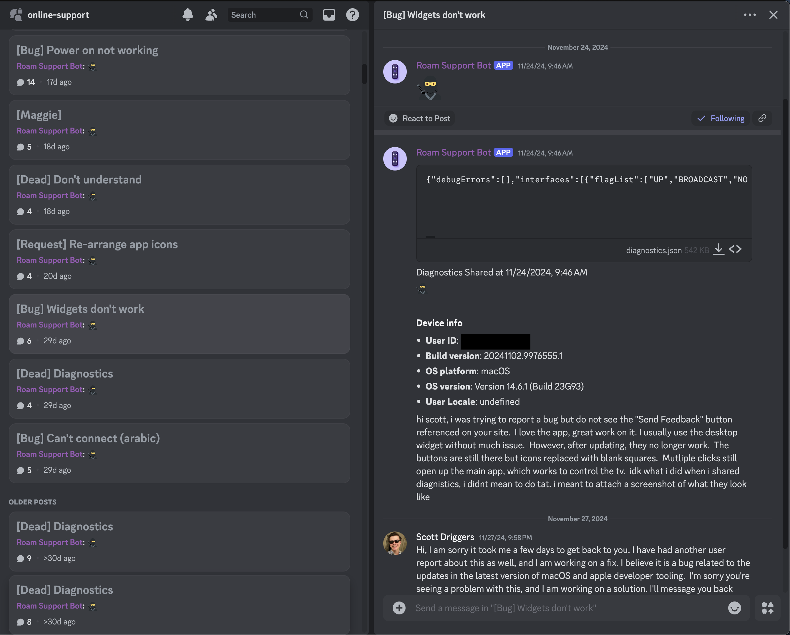
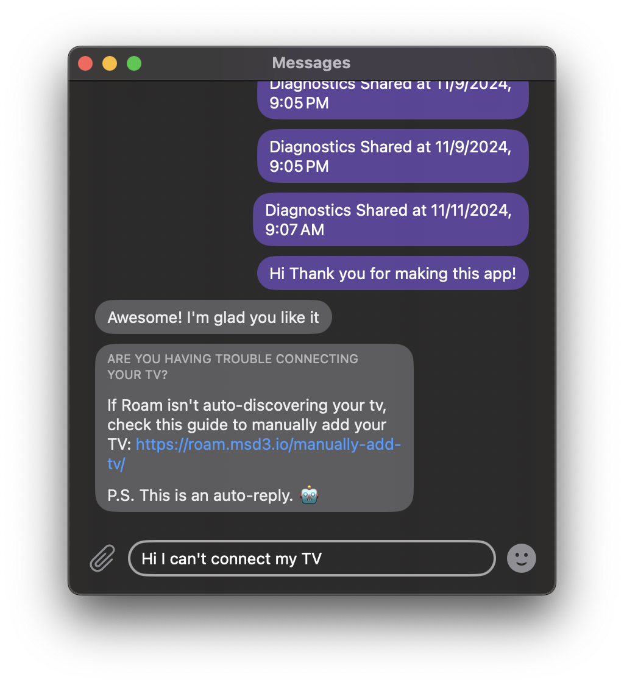

Today I'm writing about how I implemented a Discord-based in-app messaging system in my iOS/macOS application [Roam for Roku](https://apps.apple.com/us/app/roam-a-better-remote-for-roku/id6469834197). This feature allows users to ask questions and provide feedback directly within the app instead of emailing me or leaving a negative review with their feedback. I got the idea for this feature from a wonderful blog post ([https://papereditor.app/dev](https://papereditor.app/dev#feedback)) from the developer of the Paper application. So today I am going to describe how I implemented the same feature in my [open-source app](https://github.com/msdrigg/roam) with a Discord backend.

<!-- truncate -->

## Backend Architecture

My goals for this feature were the following (in order).

1. The smooth feel of the native iMessage app
2. Run with minimal cost and little cloud infrastructure to manage
3. Real-time messaging and notification capabilities
4. Allow collecting and sharing app diagnostics directly in-chat

Paper's approach to it's backend was to use dropbox to store json files that get synced to the developers computer and to the users' devices. The developer can edit them (maybe with some home-grown GUI) and then these new responses get synced to the users's device and show up as a new message. This has the benefit of being totally free (within Dropbox's free tier) but it doesn't provide a real-time experience and notifications would be hard to bolt onto it.

My plan was to use a discord server and a custom backend to achieve all my goals with minimal cost. Here is the architecture I came up with.

One big benefit of this architecture is that my backend code is stateless and can be deployed however cloudflare sees fit to handle traffic in 0-N nodes wherever in the world. This stateless backend connects to Discord's API and returns messages for that user, and it stores any user metadata (APNS token, Discord Thread ID, last transmitted message id, etc.) in cloudflare KV on a per-user basis. All metadata is small and single-valued so there is no need for any kind of relational database or object storage.

The only tricky piece of this system is that all requests to the KV storage platform need to be serialized. When I first tested this without serialization, double-writes or read-after-write's often caused incorrect behavior when two requests get handled concurrently. I solved this by routing all relevant KV writes through a Cloudflare Durable Object. Durable Objects (DO's) are a concurrency tool with a lot of flexibility, but for my use case all I use them for is to ensure requests are handled one at a time in a FIFO queue (which they do out-of-the-box).

On the Discord side, I considered several methods for how to handle multiple independent user message threads. To meet my needs, each user's messages would need to be handled independently, and I would also need to be able to query ALL recent messages for ANY users for the purpose of sending push notifications. This query requirement prevented me from using a channel-per-user because there isn't an API to request all messages across all channels in a server. Instead I ended up using Discord's [Forum Channels](https://support.discord.com/hc/en-us/articles/6208479917079-Forum-Channels-FAQ) model. A single one of these channels contains individual sub-threads that are meant to be used as individual Q&A's from within a single larger channel. This works perfect for my use case because I can create one thread per user and then route all the users messages to their own self-contained thread while at the same time querying for the most recent messages in that channel and receive all the messages for across all users.

You can find the code for my whole backend at this link: [https://github.com/msdrigg/Roam/tree/main/backend](https://github.com/msdrigg/Roam/tree/main/backend).

### Push Notifications

Now that I had the stateless HTTP architecture setup, I needed to find a way to send real-time push notifications for each new message. Discord has a [gateway API](https://discord.com/developers/docs/events/gateway) that is built just for the real-time use case. Developers interact with this API by establishing and maintaining a long-term websocket connection with the Discord servers, which unfortunately is not possible on the Cloudflare Workers platform. Even though workers do have some background-task capabilities, these tasks must be relatively short-lived and will start to become unstable if they are forced to maintain a quiet websocket connection indefinitely. On top of this, Discord has very strict rate limits for new Gateway connections and will ban your app if it reconnects too frequently.

While Cloudflare Workers isn't great for this use case, [fly.io apps](https://fly.io/docs/apps/overview/) is perfect! Fly apps behave like simple EC2 machines that run at very low cost and can stay alive indefinitely. They can be deployed trivially and I even have a grandfathered hobby plan that allows me to run a couple of micro-vm's for free.

I am most familiar with rust in the backend and I wanted to keep this backend very lean to stay within fly's grandfathered free tier so I built the backend using a rust server and the `serenity` crate (which provides a wrapper around the Gateway API). In total the full code to handle push notifications is about 90 lines and is very lean. It doesn't even send push notifications itself--it makes requests to the cloudflare workers server which handles communication with APNS itself.

One final thing to note is that all communication with Apple must be over HTTP-2 because Apple doesn't want every developer to establish a new connection for every push notification that gets sent. Using HTTP-2 solves this issue directly, because it re-uses connections across multiple notifications. I found it convenient that cloudflare workers automatically upgrades to HTTP-2 in it's outgoing requests when possible.

On the whole, the backend is done with 0 node-js dependencies and only 4 direct rust dependencies, so everything works with very little code that I am relying on to make everything work.

You can find the whole code for the gateway engine here [https://github.com/msdrigg/Roam/tree/main/gateway-backend](https://github.com/msdrigg/Roam/tree/main/gateway-backend), and my code for sending APNS requests here [https://github.com/msdrigg/Roam/blob/a46652598584b39e4069afc820d6d2a8f97faef2/backend/src/apns.ts](https://github.com/msdrigg/Roam/blob/a46652598584b39e4069afc820d6d2a8f97faef2/backend/src/apns.ts)

### Sending Diagnostics

So sending diagnostics was my last goal and it's actually the easiest. Discord allows file uploads directly within threads. So I added an `/upload-diagnostics` route and accept a JSON body containing a collection of relevant fields

-   Running network Interfaces and their parameters
-   Device logs (captured by my process via `OSLog`)
-   Installation parameters (OS Version, App Version, User ID, User Locale, ...)
-   Configured Roku TV's
    -   Device metadata
    -   Connectivity status
    -   List of installed Apps

This is a lot of user information, but each piece has been added in the process of me troubleshooting some user issue. Additionally, I believe it is not an invasion of user privacy because the app never sends any of this information unless the user specifically clicks "Share diagnostics" from within the chat window. On top of this, I also don't share this data with anyone and or even store it anywhere other in the discord chat history.

On top of uploading this as a JSON file, I also send a machine-generated markdown nested list showing a summary of the device metadata that is most commonly used to troubleshoot user issues.

## Discord Setup and Support-Specific Features

From my side, the whole setup is just a discord server with a single "online-support" forum channel. The many individual threads within that channel contain conversations with each user. Here's what it looks like for me currently.

You'll notice that discord naturally surfaces the conversations with new messages and lets the old dead conversations fall down to the bottom (without losing them entirely).

Taking a look at the picture above, you can see that I categorize each request as either `[Bug]`, `[Dead]` `[Request]` or `[Thanks]` and give it a title based off what the conversation is about. You can also see that I have a `#general` channel and that this Discord server is open to the public. You can join if you want (see the link at the bottom of this blog), but you won't be able to see my `#online-support` channel because it is restricted to only me and my support bot.

For a few more support-specific features let's take a look at an individual chat with a user I had recently

Notice here that I am speaking with `Roam Support Bot`. This is a bot that I setup to actually publish the messages in discord that the users send to my API. I have to configure it like this because all API-interactions with Discord need to go through a discord Bot.

Also notice that there are a lot of messages that start with `:ninja:`. This is a secret prefix that I use to send non-user messages in the channel. You see some device metadata and the thread creation message itself. These `:ninja:` messages get filtered out by my backend so the end user never sees them. This lets me add notes to a thread directly, or for the app to send user metadata without confusing the user in their thread window.

Lastly, note the diagnostics upload, this isn't really previewable within Discord but it is easily downloadable and analyzable in VSCode. In a future release (not published yet), I have added some commonly-relevant metadata directly in the thread in a `:ninja:` message so I can see it directly without having to download and read through the full log file.

## Frontend

The frontend display for these messages is a simple `SwiftUI` interface that loads a list of `Message` models from local storage via a `SwiftData` binding and displays them in a scrolling `LazyVStack`. The interaction with the backend is to refresh messages and send messages. The messages are stored locally and only refreshed as needed at the following times

-   Periodically while the app is in the foreground
-   Whenever a push notification is received indicating a new message
-   Whenever a message is sent by the user

There are a few fun features though. One feature I stole from the original Paper blog post is to have auto-responses for common request. One such request is that users can't connect their device, so if a user starts to type out "I can't connect my TV", a curated response is returned with a way to manually add their TV.

Another fun little feature in the messages is clickable-links (see one in the screenshot above). Getting clickable links working within these views messaging views was surprisingly tricky because the naive way would be to parse the links from the text and then somehow combine text views with inline `Link` views. But I noticed that as of iOS 15, `SwiftUI` `Text` view automatically handle some simple markdown features including links (e.g. `[link preview](https://link.example.com)`). So now the only change that needed to be made was to automatically regex-replace links like `https://link.example.com` with `[https://link.example.com](https://link.example.com)` before the text gets rendered.

Finally, the frontend uses `SwiftData` for storage, `SwiftUI` for rendering, and the `URLSession` framework for https requests. All of these frameworks are 100% crossplatform, so this UI works equally well on macOS, iOS, watchOS, visionOS or even tvOS. In practice though, I only have it available on the iOS, visionOS and macOS versions of my App due to challenges with displaying and entering in text messages on tvOS and watchOS.

My code for the frontend can be found [here](https://github.com/msdrigg/Roam/blob/a46652598584b39e4069afc820d6d2a8f97faef2/Roam/Views/MessagingView.swift) and [here](https://github.com/msdrigg/Roam/blob/a46652598584b39e4069afc820d6d2a8f97faef2/Shared/Backend/WorkersBackend.swift) and [here](https://github.com/msdrigg/Roam/blob/a46652598584b39e4069afc820d6d2a8f97faef2/Shared/Models/SchemaFile.swift#L161) and [here](https://github.com/msdrigg/Roam/blob/a46652598584b39e4069afc820d6d2a8f97faef2/Shared/Models/DataActor.swift#L630)

I did consider breaking this out into a separate swift package, but I think Roam's assumptions about how messages work are a bit too baked-in and I would rather others to simply copy my code into their own projects if they want to replicate this feature.

## Security and other considerations

So as with any mobile-app backend, there were a lot of security challenges I encountered as I built this backend. First of all, how can I authenticate users when my app is open source and I don't have any user passwords. My (rather naive) approach is to auto-generating a 9-character user ID for each device. This allows for about 5.5 trillion possible unique ID, so if my API got hit at discord's 50 req/s rate limit then an attacker would be able to find a user's messages in about 3000 years and I would notice long before that. I could (and will) make this user ID longer but the data involved isn't sensitive enough that I'm worried about it.

Each request also contains a API Key that isn't public and the backend url also isn't published directly in the source code on github (it is added alter in a config file via env variables). So I do have a little bit of security-through-obscurity as well. But I am aware that these roadblocks would not stop a dedicated attacker who could access these variables by decrypting the application after they install it on their device.

Finally, I will say that my security could be significantly better. First of all, I am susceptible to DOS attacks. If an attacker was to send thousands of requests to my backend, there is nothing in place to stop them and they would get my discord bot rate limited and possibly banned. They would also be able to flood my discord channels making them unusable, but they would not be able to read any other user's messages or rack up any fees on my end because cloudflare workers are capped under the free tier.

I will say that if I needed to worry about rate-limits and DOS attacks I would start by requiring all requests to contain a unique and valid APNS token, and then rate limiting individual users. This way I could slow down bad-acting individual users and then ban them while preventing the attackers from creating new users without a new valid APNS token (which isn't easy to get without manual human input). In this way, Apple would basically be my user-verification service to ensure that all my users are real people and not bots.

## Conclusion

So at the beginning of this story I outlined my

-   Simple messaging interface for users to contact me in-app
-   Push notifications and real-time communication
-   Easy infrastructure with Minimal expenses
-   Allow sharing user diagnostics and logs

I can say that this build has completed all of these goals and is feature complete from my perspective. I may add more auto-responses or tweak some things here or there, but I consider it done. The whole backend system has less than 800 lines of code across both backends (rust and nodejs), and each gets updated every time I push a change to Github. This all happens for $0 a month because I am under the Cloudflare, Fly.io, and Github actions free tiers.

Overall this work has yielded some very rewarding interactions with people. Several people have messaged me just to say "Thanks for making the app", and many more have thanked me for my help answering their questions or expressed surprise at the existence of a live chat window in their remote app.

I have also had two other developers reach out to say that they thought the app was really impressive and they appreciated it. One of them was a developer at Warner-Brothers/Max and said he had recommended it to his whole team there.

I think an in-app messaging feature is probably a bit overkill for an app as simple as Roam, but it has let me connect with my users in a way that would not have been possible without it.
