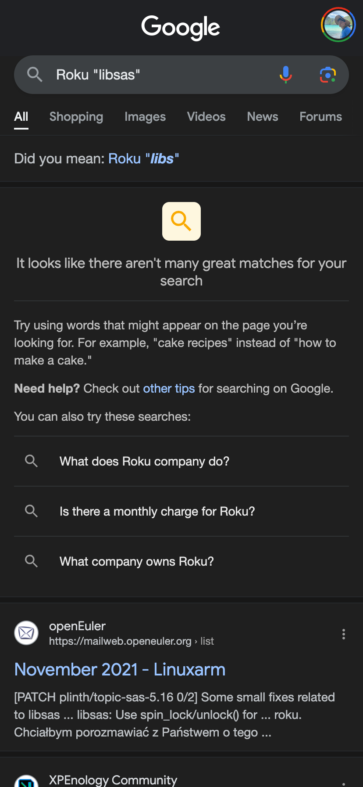
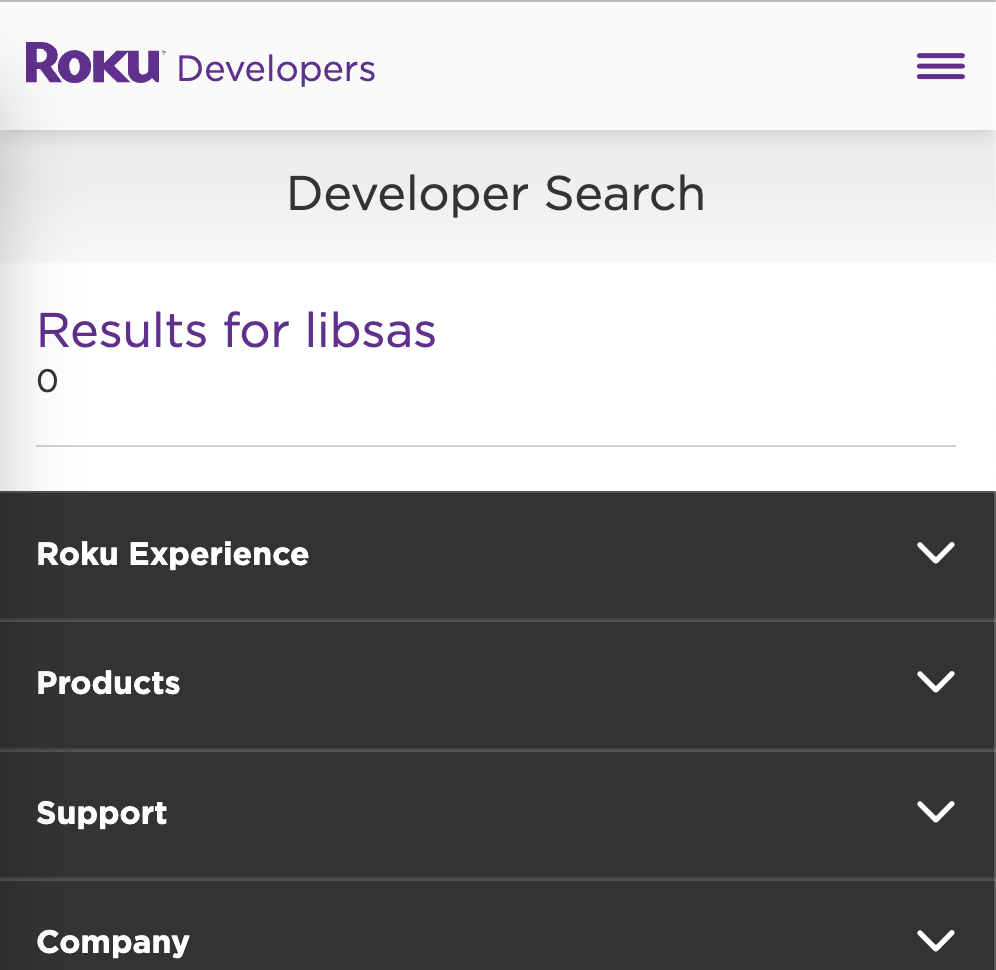

## What is it

-   Roku's private listening mode mobile-sas (LibSAS) is an audio streaming framework framework built to replace the previously used RTP/RTCP implementation.

## Why do I care

-   I make the best Roku Remote that supports private listening mode
-   Have the previous RTP/RTCP implemented in my app
-   But what if Roku stops supporting it? Where would I go?

## How can we learn more

-   
-   

Lets try reverse engineering it.

-   Download ipa with ipatool
-   Find libsas. Looks promising
-   Open in ghidra, garbage

Ohh, it's encrypted. Google "Decrypted download ios app. Find https://decrypt.day/

-   Download it

-   Looks much more promising

-   Find the private listening mode and investigate

-   Uses opus with home grown FEC (doesn't use OPUS's)
    -   Convolutional, Binary Finite Field?
    -   https://ocw.mit.edu/courses/6-451-principles-of-digital-communication-ii-spring-2005/43162a4e10d73639903282f4dd58001b_chap9.pdf
-   Uses a udp protocol to send/receive the data stream

<!-- truncate -->

-   ## Can we get anything else out of reversing the android app?
