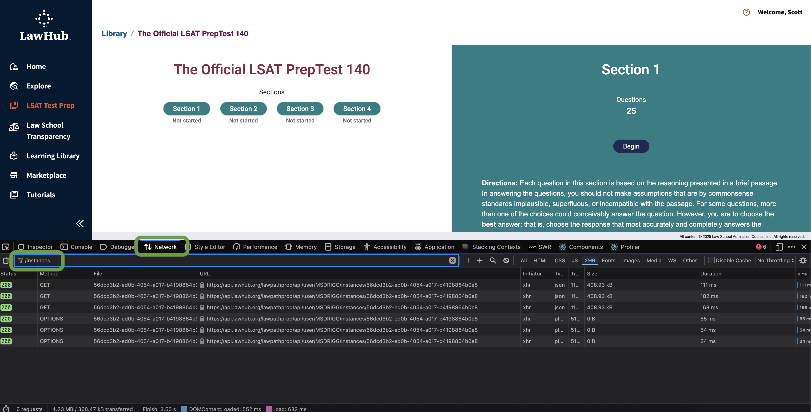

import LSATRenderer from './LSATRenderer.tsx';
import './printable.css';

I created LSAT Warthog to render the LSAT tests available on LawHub as HTML to allow easy PDF printing and on-paper test prep.

{/* truncate */}

I have pre-loaded the free LSAT tests from the site, so you can select from `140`, `141`, `157`, and `158` in the dropdown below. If you want to render a different test, you will need to download the JSON data for that test from your own lawhub account and paste it into the text area yourself.

How to get access the LSAT test JSON data:

1. Go to [app.lawhub.org](https://app.lawhub.org) and login.
2. Click on "LSAT Test Prep" in the left hand menu and then click "New Test" on the test you want to print.
    - 
3. Open the developer console in your browser (usually F12 or right-click and select "Inspect").
    - 
4. Click on "Start Test" so your browser will download the test data.
5. In the developer console, go to the "Network" tab and search for `/instances` in the filter box.
    - 
6. You should see a few items that show `GET`. Select on any one of these and then go to the "Response" tab in the right pane.
    - 
7. Copy the JSON data from the response tab.
8. Select 'Render my own LSAT JSON' from the dropdown below, and paste your copied data into the text area below.

<LSATRenderer/>