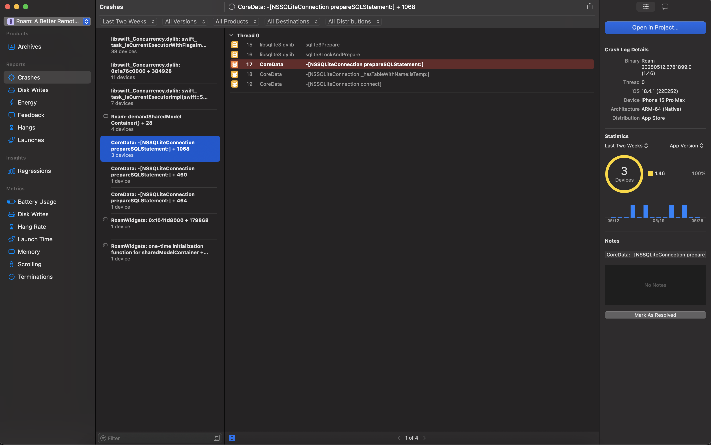

I'm writing today about another tricky crash I investigated in my [Roku remote app](https://apps.apple.com/us/app/roam-a-better-remote-for-roku/id6469834197). Unlike the [previous post](/blog/2025-05-25-silent-sigpipe-crash-caused-by-bsd-socket) in my troubleshooting journey, the iOS crash reporter actually caught this crash. What made this crash tricky was the fact that the XCode crash viewer obfuscated the underlying reason for the crash. In this post, I'm going to walk through how I identified the true cause of the crash and solved the underlying issue, and through the process I'll share some best practices I learned about managing background execution on iOS.

<!-- truncate -->

## Figuring out the issue

Take a look at this screenshot from XCode's Crash Viewer window.



In the screenshot, I'm inspecting a crash happening on a few devices caused by a `sqlite3Prepare` statement somewhere within CoreData, but it doesn't point to any particular trace within my own app.

:::note

You may notice a ton of crashes at the top having something to do with swift concurrency. But don't worry about those; it's an issue for another day 😭.

:::

## Digging deeper

-   Downloaded and inspected the raw crash report
-   Saw how the crashed thread was the main thread, but crash reason was 0xdead10cc
-   Researched and found issues pointing to my database usage (multi-process sqlite database locking)

## Solving the issue

-   This is a watchOS / iOS only issue. MacOS does not suspend processes in the same way, so it doesn't suffer from this issue.
-   Need to tell the OS "please don't suspend me", so we can access those suspension-unsafe locks

```
For app: beginBackgroundTask(withName:expirationHandler:) | Apple Developer Documentation
For app extension and watch: beginActivity(options:reason:) | Apple Developer Documentation
```

Help from Quinn:
Notes on background execution: https://developer.apple.com/forums/thread/85066
QRunInBackgroundAssertion: https://developer.apple.com/forums/thread/729335

## Posting the Fix

Fix (Background assertion): https://github.com/msdrigg/Roam/blob/cc671154e61d36747502db2b83029d5975170f74/Shared/Utils/QBackgroundExecution.swift
Fix (Add Background assertion to key code paths): https://github.com/msdrigg/Roam/commit/b7013adab0ea5c9cd2c77c754f4a060e3c6d4080

## Conclusion

-   Need to be sure when holding file locks that we hold assertions to ensure
-   My queries are slow and can all be run inside of a `QRunInBackgroundAssertion`, but we could look at how to optimize this better in the future with some kind of batching or caching these assertions
