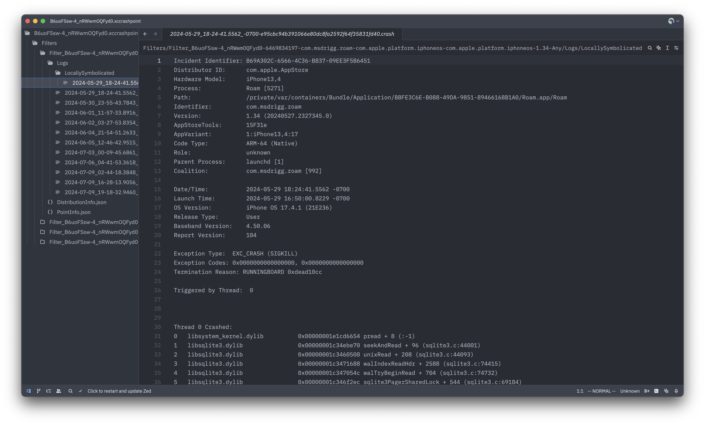

I'm writing today about another tricky crash I recently solved in my [Roku remote app](https://apps.apple.com/us/app/roam-a-better-remote-for-roku/id6469834197). Unlike the the other crash [I wrote about recently](/blog/2025-05-25-silent-sigpipe-crash-caused-by-bsd-socket), this one was actually caught by the iOS crash reporter. What made this bug particularly tricky was the fact that the standard XCode crash viewer obfuscated the underlying reason for the crash. In this post, I'm going to walk through how I identified the true cause of the crash and solved the underlying problem. At the end of the writeup, I'll share some best practices I learned about managing background execution on iOS.

<!-- truncate -->

## Figuring out the issue

As with all of my crash-fixing journeys, this one starts by looking at the crash in XCode's Crash Viewer window.


:::note

You may notice a ton of crashes at the top having something to do with swift concurrency. But don't worry about those; it's an issue for another day 😭.

:::

Today, let's focus on a crash that's happening in a few devices caused by a `sqlite3Prepare` statement somewhere within CoreData. The weird part is that I am catching all errors _including_ objective-C errors in the surrounding code:

```swift
    func fetchSafer<T>(_ descriptor: FetchDescriptor<T>) async throws -> [T] {
        return try catchObjc {
            return try self.modelContext.fetch(descriptor)
        }
    }
```

There should be no reason for the app to crash here. All errors should be caught here and passed to my app for proper handling. I guess it is possible that sqlite just emits a `fatalError` here for some reason, but that felt unlikely.

## Digging deeper

Faced with this surprising error, I decided to look at the root of the crash report. XCode organizer provides a direct link to the `.xccrashpoint` crash sourcefile by right-clicking on the crash and clicking "Show in Finder". This file is actually a folder in disguise, but it can still be opened as a unit in VSCode or Zed. Here's what the `.xccrashpoint` looks like in Zed:



You can see that there is some crash metadata files like `PointInfo.json` and `DistributionInfo.json`, but the core of the structure is a set of `.crash` files each containing a symbolicated or unsymbolicated crash report. These reports each contain stack traces for each thread, an indicator of which thread crashed, some metadata about the crashed process, and a reason for the crash.

```crash
Incident Identifier: B69A302C-6566-4C36-B837-09EE3F5B6451
Distributor ID:      com.apple.AppStore
Hardware Model:      iPhone13,4
Process:             Roam [5271]
Path:                /private/var/containers/Bundle/Application/BBFE3C6E-B088-49DA-9851-89466168B1A0/Roam.app/Roam
Identifier:          com.msdrigg.roam
Version:             1.34 (20240527.2327345.0)
AppStoreTools:       15F31e
AppVariant:          1:iPhone13,4:17
Code Type:           ARM-64 (Native)
Role:                unknown
Parent Process:      launchd [1]
Coalition:           com.msdrigg.roam [992]

Date/Time:           2024-05-29 18:24:41.5562 -0700
Launch Time:         2024-05-29 16:50:00.8229 -0700
OS Version:          iPhone OS 17.4.1 (21E236)
Release Type:        User
Baseband Version:    4.50.06
Report Version:      104

Exception Type:  EXC_CRASH (SIGKILL)
Exception Codes: 0x0000000000000000, 0x0000000000000000
Termination Reason: RUNNINGBOARD 0xdead10cc

Triggered by Thread:  0


Thread 0 Crashed:
0   libsystem_kernel.dylib        	0x00000001e1cd6654 pread + 8 (:-1)
1   libsqlite3.dylib              	0x00000001c34ebe70 seekAndRead + 96 (sqlite3.c:44001)
2   libsqlite3.dylib              	0x00000001c3460508 unixRead + 208 (sqlite3.c:44093)
3   libsqlite3.dylib              	0x00000001c3471688 walIndexReadHdr + 2588 (sqlite3.c:74415)
...
```

So the XCode organizer does a good job of surfacing the stack trace, but it totally ignores the exception type, exception code and termination reason in it's display. For this crash, the termination reason of `0xdead10cc` stood out to me as a human readable code "dead lock", and it felt like a good place to start. One google search pointed me to [this apple developer support article](https://developer.apple.com/documentation/xcode/sigkill) about the `SIGKILL` termination reasons.

This article helpfully lays out the cause of the `0xdead10cc` crash.

> The Termination Reason code is one of the following values:
>
> 0xdead10cc (3735883980) — pronounced “dead lock”
>
> -   The operating system terminated the app because it held on to a file lock or SQLite database lock during suspension. Request additional background execution time on the main thread with beginBackgroundTask(withName:expirationHandler:). Make this request well before starting to write to the file in order to complete those operations and relinquish the lock before the app suspends. In an app extension, use beginActivity(options:reason:) to manage this work.
>
> ...

This diagnosis fit with the crashes I was seeing because

1. I use SwiftData heavily in my app, and SwiftData internally relies on SQLite for storing objects
2. The crash stack traces always mentioned libsqlite3, typically at the very top, which indicated the possibility for SQLite database locking

## Solving the issue

Thankfully, apple provides us a helpful indicator of how to solve the problem. All we need to do when we are about to perform a locking operation is to tell the os: "please don't shut me down, give me a little more time". Then the OS can either grant us that request, or deny it and we can avoid doing the locking work in the first place. This request to the OS can be done using one of two APIs

1. In a standard iOS application context, we can use `UIApplication.beginBackgroundTask(withName:expirationHandler:)`
2. In a widget or watchOS context, we can use `ProcessInfo.beginActivity(options:reason:)`

In macOS applications, we have access to `ProcessInfo.beginActivity(options:reason:)`, but we don't actually have to use it because it seems like macOS doesn't suspend apps in the background in the same way iOS and watchOS do. So we don't need to add these API's to our macOS build.

Now, lets break down how we can use these APIs', starting with `beginBackgroundTask`. This API can be called in this way:

```swift
        let taskID = UIApplication.shared.beginBackgroundTask(withName: "HelpfulDebuggingName") {
            // Completion handler called when task is expiring
            cancelLockingWorkQuickly()
        }
        // the returned taskID is invalid when the app is already suspending
        guard taskID != .invalid else { return }
        await performLockingWork()
        UIApplication.shared.endBackgroundTask(self.taskID)
```

You see here that we wrap our suspension-unsafe calls in an API that makes them background-safe with just a little bit of overhead.

Unfortunately, the activity API is a bit bit trickier. The method we actually want is `performExpiringActivity(withReason:using:)`. We provide `performExpiringActivity` with a callback that gets called twice: once to notify us that we can start our work, and again to notify us that our app is about to be suspended. This double-call system makes wrapping an existing async function tricky, because our callback can get called two times, and we have to store a handle to cancel the task sometime between those two calls. Having to monitor this state and use it across background calls is tricky to manage in a threadsafe way.

Thankfully, as always, Quinn is here to rescue me from Apple platform failings. A just a couple years ago, he responded to a [developer forum post](https://developer.apple.com/forums/thread/729335) where he wrote out code for a `QRunInBackgroundAssertion` class that provides a simpler unified API to allow handling suspension state with the following code

```swift
    let assertion = await QRunInBackgroundAssertion(name: name)
    if await !assertion.isReleased() {
        await performLockingWork()
    }
    await assertion.release()
```

If you want to learn more about how background work is managed on iOS and why it's necessary to use `QRunInBackgroundAssertion`, Quinn has a much longer post called [UIApplication Background Task Notes](https://developer.apple.com/forums/thread/85066) where he goes further into the details than I do here.

## Applying the fix

So now that we know the problem is sqlite3 locks, we need to identify the places in the app that can cause these dead locks. Looking through the crashes, I can identify three places crashes can occur: `ModelContainer.init`, `modelContext.fetch`, and `modelContext.save`. These three methods interface with sqlite in such a way that it can obtain database locks and cause crashes in your app when it enters the background.

These fixes are pretty simple. Lets look at our solution to the `modelContext.fetch` crash. Thankfully, I had already wrapped `modelContext.fetch` in a `fetchSafer` handle, so we only had to apply this code fix in one place:

```swift
    func fetchSafer<T>(_ descriptor: FetchDescriptor<T>) async throws -> [T] {
        return try catchObjc {
            return try self.modelContext.fetch(descriptor)
        }
    }
```

And here's what the background-safe version looks like:

```swift
    #if !os(macOS)
    func fetchSafer<T>(_ descriptor: FetchDescriptor<T>) async throws -> [T] {
        let assertion = await QRunInBackgroundAssertion(name: "FetchSafer")
        var result: [T]?
        do {
            if await !assertion.isReleased() {
                result = try catchObjc {
                    return try self.modelContext.fetch(descriptor)
                }
            }
            await assertion.release()
        } catch {
            await assertion.release()
            throw error
        }
        if let result {
            return result
        } else {
            throw DataHandlerError.suspending
        }
    }
    #else
    func fetchSafer<T>(_ descriptor: FetchDescriptor<T>) async throws -> [T] {
        return try catchObjc {
            return try self.modelContext.fetch(descriptor)
        }
    }
    #endif
```

You can see it does complicate this very simple function quite a bit, but I only have 3 places to make this change, so it's not too bad. To see the full change, [take a look here](https://github.com/msdrigg/Roam/commit/b7013adab0ea5c9cd2c77c754f4a060e3c6d4080)

I do wonder however how much overhead this is adding to my database calls, because this code runs on _every_ data load and save. These in theory happen very frequently as SwiftData is regularly refreshed. I wonder if we should optimize this in the future with some kind of token caching so we don't have to re-create tokens for every query.

## Conclusion

Since I pushed this fix, I haven't seen _any_ of these 0xdead10cc errors. It's a really good feeling when a simple fix totally removes a whole class of errors like this.

One thing I learned for sure from this adventure is that I need to always look a little deeper at the lower level diagnostic reports when investigating confusing crashes. Sometimes this means looking at the raw `.crash` files, but sometimes it means opening up `Console` and looking through live logs or creating a sysdiagnose and checking out the full crash trace.

Another thing I am learning again and again lately is that I need to be careful with low-level primitives like file locks. These objects can solve difficult problems, but they often come with unintended side effects, and I need to read through the documentation closely when I use them in my own code.

But in this case, reading up on file locks would not have helped me prevent this issue, because these file locks were deep within somebody elses code. I actually think it should be up to the SwiftData team to make their library background-safe, or show clearly in the documentation that it is not. Problems like these remind me that I need to constantly avoid complex and heavy libraries in my app, even first-party libraries like `SwiftData`. These libraries can make development easier, but they always come with costs.

At the end of the day, I am very glad to solve this issue and make progress toward crash-zero in Roam.

If you have any questions or comments on this post, send me an email at scott@msd3.io or create an issue on the [roam github](https://github.com/msdrigg/roam)
